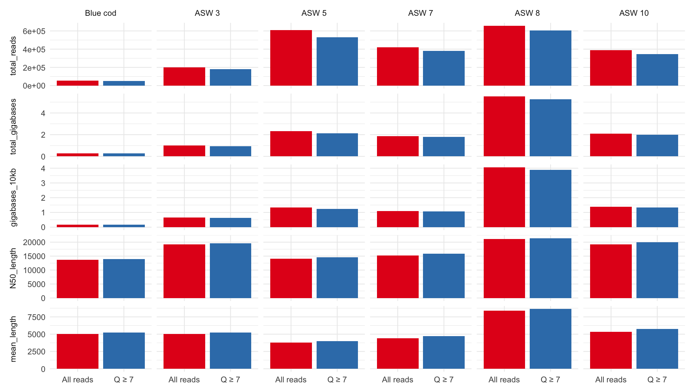

Welcome to website for the Genomics Aotearoa ONT MinION workshop, which ran at the University of Otago, Dunedin, from 17th--19th April, 2018.

## Schedule

[Click here](./docs/Structure.md)

## Presentations
- [Simone Cree](mailto:simone.macmil@otago.ac.nz):
    - [Long read nanopore sequencing in the laboratory](https://drive.google.com/file/d/1HOKSwutiWD6j_7RFsfGMw146fOSxJPRJ/view?usp=sharing)
- [Chris Winefield](mailto:Christopher.Winefield@lincoln.ac.nz):
    - [Oxford Nanopore Sequencing in recalcitrant plant species](https://drive.google.com/file/d/1S-2qns28s-hQkldCxjQ_JsTGzD4Zrwej/view?usp=sharing)
- [Benjamin Schwessinger](mailto:Benjamin.Schwessinger@anu.edu.au):
  - [Insights into DNA extraction and library preparation for Nanopore sequencing on the MinION](https://drive.google.com/open?id=1jBrELEcyI9zFC8L7Kb0t4kuNmLj-tbhF)
- [Louise Judd](mailto:lmj@unimelb.edu.au):
  - [TBA](link)
- [Kirston Barton](mailto:k.barton@garvan.org.au):
  - [HMW DNA on Nanopore](https://drive.google.com/open?id=1HAXkELHUmEcNlgDcumCxbdw8cUB9wx6u)
  - Lab session: [QCing your DNA before a library prep](https://drive.google.com/open?id=1BExiW2u-kUa-p0dGqZRX3785QszLcF4L)
- [Alexis Lucattini](mailto:alexis.lucattini@agrf.org.au):
  - [Alignments, Quirks, Methylation and Assembly](https://alexiswl.github.io/presentations/nanopore_dunedin/nanopore_dunedin.html)

## Tutorials
1. [Handling MinION data from your laptop](https://alexiswl.github.io/ASimpleNanoporeTutorial/running_poreduck.html)
2. [Setting up a virtual environment](./docs/vagrant_setup.md)
3. [Handling fast5 data on a server](./docs/workshop/tutorial.html)

## Information for Participants
[Click here](./docs/Info.md)

## Course results

- [Sample QC and library prep results PDF](https://drive.google.com/open?id=1QZqew-GirWuYyxb_RQUlB8RDG8qiYBzm)
- [Sample and sequencing spreadsheet](https://drive.google.com/open?id=1vT_okUPXPBR4ynXj1cv7S4arH_gUkZ1C)

## Links
- **Nanopore group on [protocols.io](https://www.protocols.io/groups/minion-user-group-with-fungi-and-plants-on-their-mind)**
- Olin's [ultra cheap magnetic rack](http://samandtomindustrys.science/borchure.html)

## Organisers
+ [Tom Harrop](mailto:tom.harrop@otago.ac.nz)  
    - [Welcome slides](./docs/slides/welcome.pdf)
+ [Angela Hendry](mailto:genomics.aotearoa@otago.ac.nz)  
+ [Andy Nilsen](mailto:andy.nilsen@otago.ac.nz)  
